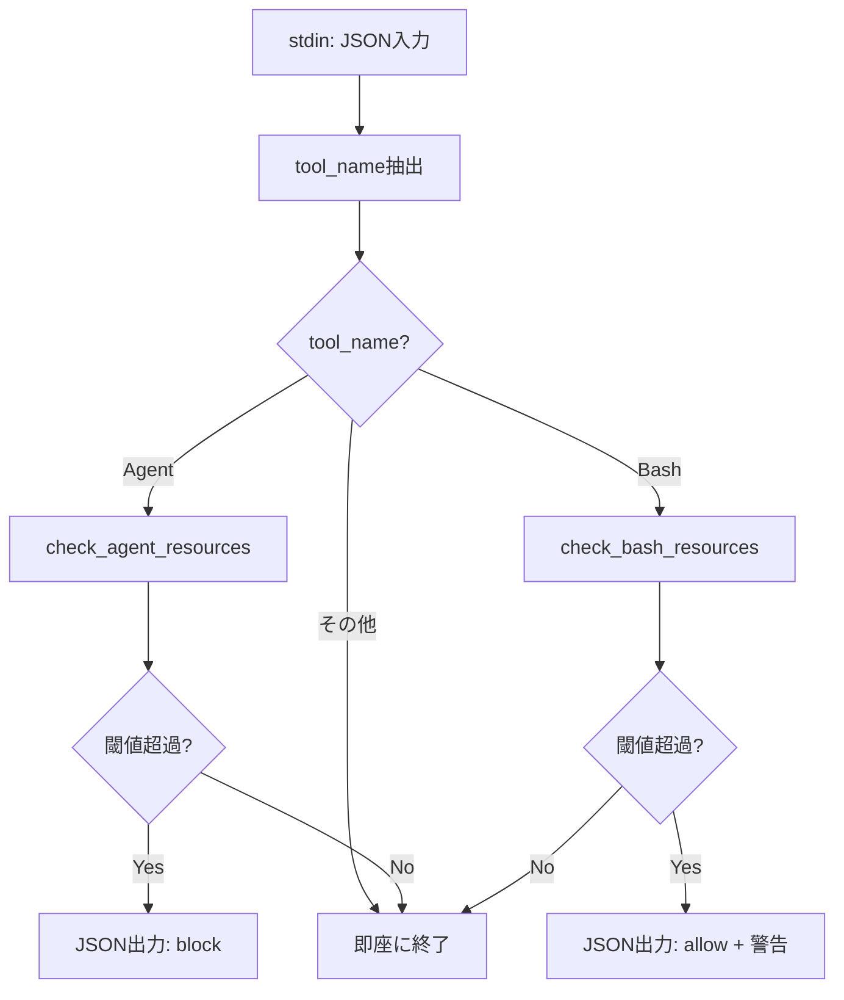

# hook-dispatcher（フックディスパッチャー）

## 概要

**目的**: Claude CodeのPreToolUseフックのエントリポイント。stdinからフック入力JSONを受け取り、ツール名に応じて適切なチェック処理を振り分ける。

**責務**:
- stdinからフック入力JSONを読み取る
- ツール名（`tool_name`）を判定する
- ツール名に応じてリソースチェック関数を呼び出す
- チェック結果をJSON形式でstdoutに出力する

## インターフェース

### 入力（stdin）

Claude Codeからフック呼び出し時に渡されるJSON:

```json
{
  "session_id": "abc123",
  "tool_name": "Agent",
  "tool_input": { ... }
}
```

### 出力（stdout）

#### ブロック時（Agent起動 + 閾値超過）
```json
{
  "decision": "block",
  "reason": "[ccresmon] メモリ使用率が閾値を超過しています (現在: 92%, 閾値: 85%)。しばらく待機してから再試行してください。"
}
```

#### 警告時（Bash実行 + ディスクI/O超過）
```json
{
  "decision": "allow",
  "reason": "[ccresmon] ディスクI/O負荷が高い状態です (現在: 78%, 閾値: 70%)。処理速度が低下する可能性があります。"
}
```

#### 正常時（閾値以下）

何も出力しない（空出力 = 許可）。

## 処理フロー



## 依存関係

### 依存するコンポーネント
- [resource-collector](resource-collector.md) @resource-collector.md: リソース情報の取得
- [threshold-config](threshold-config.md) @threshold-config.md: 閾値設定の読み込み

### 依存されるコンポーネント
- なし（Claude Codeフックから直接呼び出される）

## 内部設計

### 実装方針

単一のシェルスクリプト `ccresmon.sh` として実装する。コンポーネント分割は関数レベルで行い、ファイル分割はしない（NFR-PERF-001: 100ms以内、NFR-PERF-003: 外部プロセス最小化のため）。

### JSON読み取り

stdinからのJSON読み取りは、`jq` を使わず bash の文字列操作で行う（外部依存排除: NFR-CMP-002）。

```bash
# tool_nameの抽出（軽量実装）
read -r input
tool_name=$(echo "$input" | grep -o '"tool_name"[[:space:]]*:[[:space:]]*"[^"]*"' | grep -o '"[^"]*"$' | tr -d '"')
```

## エラー処理

| エラー種別 | 発生条件 | 対処方法 |
|-----------|---------|---------|
| stdin読み取り失敗 | パイプが壊れている | 即座に exit 0（許可扱い） |
| JSON解析失敗 | 不正なJSON | 即座に exit 0（許可扱い） |
| tool_name不明 | 未知のツール名 | 即座に exit 0（許可扱い） |

**設計原則**: エラー時はフェイルオープン（許可扱い）とする。監視スクリプトの不具合でClaude Codeの動作を妨げてはならない。

## テスト観点

- [ ] 正常系: Agent起動時にメモリ・CPUチェックが実行される
- [ ] 正常系: Bash実行時にディスクI/Oチェックが実行される
- [ ] 正常系: Agent/Bash以外のツールでは何もせず終了する
- [ ] 異常系: 空のstdinで正常終了する
- [ ] 異常系: 不正なJSONで正常終了する（フェイルオープン）
- [ ] 境界値: tool_nameが空文字列の場合

## 関連要件

- [REQ-001-001〜006](../../requirements/stories/US-001.md) @../../requirements/stories/US-001.md: Agent起動時のリソースチェック
- [REQ-002-001〜004](../../requirements/stories/US-002.md) @../../requirements/stories/US-002.md: Bash実行時のディスクI/O監視
- [NFR-PERF-001](../../requirements/nfr/performance.md) @../../requirements/nfr/performance.md: 100ms以内の実行時間
