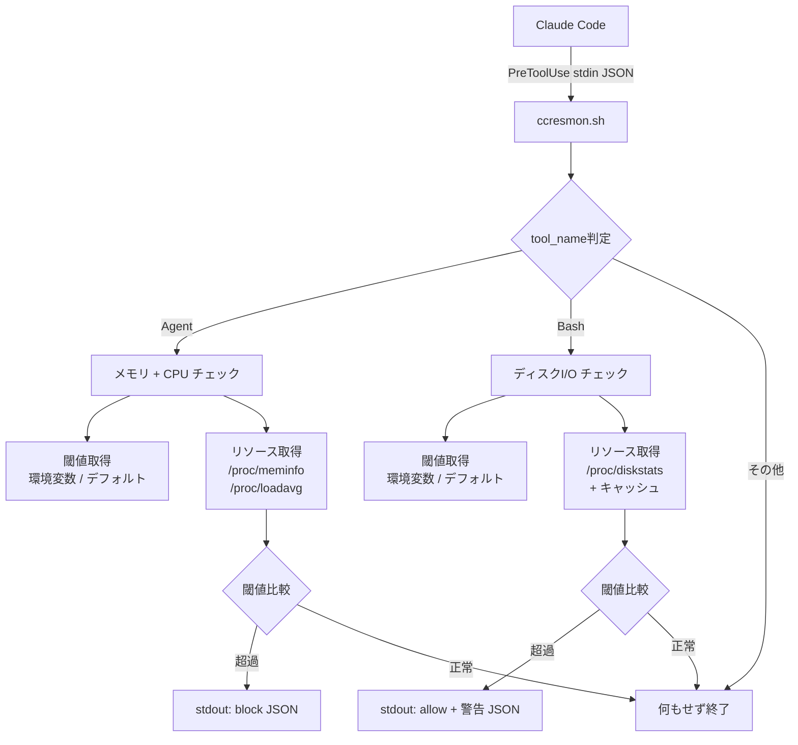

# 設計

> このドキュメントはAIエージェント（Claude Code等）が実装を行うことを前提としています。

## 情報の明確性チェック

### ユーザーから明示された情報
- [x] 技術スタック: bashシェルスクリプト（外部依存なし）
- [x] アーキテクチャパターン: Claude Code PreToolUseフックスクリプト
- [x] 対象プラットフォーム: Linux（WSL2含む）。Windows対応は望ましいが必須ではない
- [x] データベース: なし（ステートレス、キャッシュは/tmpのみ）
- [x] 外部サービス連携: なし
- [x] セキュリティ要件: フェイルオープン設計、ブロック理由の明示
- [x] パフォーマンス要件: 100ms以内、メモリ5MB以下、外部プロセス5個以下
- [x] 設計方針: 安全性重視、シンプルで枯れた方法

### 不明/要確認の情報

なし（すべての情報が明示済み）

---

## アーキテクチャ概要

ccresmonは単一のシェルスクリプト `ccresmon.sh` として実装する。Claude CodeのPreToolUseフックとして登録され、ツール実行前にstdinからJSONを受け取り、リソースチェックの結果をstdoutにJSON出力する。



### ファイル構成

```
ccresmon/
├── ccresmon.sh              # メインスクリプト（全ロジック集約）
├── README.md                # インストール手順・使い方
├── tests/
│   └── ccresmon.bats        # テスト（bats-core）
└── docs/
    └── sdd/                 # 設計ドキュメント
```

### 外部プロセス起動数（NFR-PERF-003対応）

| 処理パス | 起動される外部プロセス | 合計 |
|---------|---------------------|------|
| Agent起動時 | `grep`×2, `awk`×1, `cut`×1, `nproc`×1 | 5個 |
| Bash実行時 | `awk`×1, `date`×1, `cat`×1 | 3個 |

※ bash組み込みコマンド（`read`, `echo`, `printf`, `[`, `[[`）は外部プロセスとしてカウントしない

## コンポーネント一覧

| コンポーネント名 | 目的 | 詳細リンク |
|-----------------|------|-----------|
| hook-dispatcher | フックエントリポイント・ツール振り分け | [詳細](components/hook-dispatcher.md) @components/hook-dispatcher.md |
| resource-collector | リソース情報収集（メモリ・CPU・I/O） | [詳細](components/resource-collector.md) @components/resource-collector.md |
| threshold-config | 環境変数からの閾値読み取り・バリデーション | [詳細](components/threshold-config.md) @components/threshold-config.md |
| message-formatter | ブロック・警告メッセージのJSON生成 | [詳細](components/message-formatter.md) @components/message-formatter.md |

> すべてのコンポーネントは単一ファイル `ccresmon.sh` 内の関数として実装される（DEC-001）。

## 技術的決定事項

| ID | 決定内容 | ステータス | 詳細リンク |
|----|---------|-----------|-----------|
| DEC-001 | 単一スクリプト構成の採用 | 承認済 | [詳細](decisions/DEC-001.md) @decisions/DEC-001.md |
| DEC-002 | ディスクI/Oサンプリングにキャッシュ方式を採用 | 承認済 | [詳細](decisions/DEC-002.md) @decisions/DEC-002.md |
| DEC-003 | フェイルオープン設計の採用 | 承認済 | [詳細](decisions/DEC-003.md) @decisions/DEC-003.md |

## セキュリティ考慮事項

- **フェイルオープン**: スクリプトの不具合でClaude Codeの動作を妨げない（DEC-003）
- **入力バリデーション**: 環境変数の値を厳密に検証し、不正値はデフォルトにフォールバック
- **情報漏洩なし**: スクリプトはシステムのリソース情報のみを扱い、ユーザーデータには一切アクセスしない
- **権限最小化**: 一般ユーザー権限で動作。root権限不要

## パフォーマンス考慮事項

- **100ms以内**: procfsの直接読み取りと bash 組み込みコマンドを最大限活用（NFR-PERF-001）
- **5MB以下**: シェルスクリプトのプロセスメモリは通常1-2MB（NFR-PERF-002）
- **外部プロセス5個以下**: `grep`, `awk`, `cut`, `nproc` 等の最小限のコマンドのみ使用（NFR-PERF-003）
- **ディスクI/Oキャッシュ**: `sleep` を排除し、前回値とのdiffで算出（DEC-002）

## エラー処理戦略

| レベル | 対象 | 戦略 |
|-------|------|------|
| スクリプト全体 | 予期しないエラー | `trap 'exit 0' ERR` でフェイルオープン |
| リソース取得 | procfs読み取り失敗 | 0を返す（閾値を超過しないため許可扱い） |
| 閾値設定 | 環境変数の不正値 | デフォルト値にフォールバック |
| JSON入力 | stdin解析失敗 | 即座にexit 0（許可扱い） |
| キャッシュ | /tmp読み書き失敗 | I/Oチェックをスキップ（許可扱い） |

## フック登録設計

### settings.json設定例

```json
{
  "hooks": {
    "PreToolUse": [
      {
        "matcher": "Agent|Bash",
        "hooks": [
          {
            "type": "command",
            "command": "/path/to/ccresmon/ccresmon.sh",
            "timeout": 5
          }
        ]
      }
    ]
  }
}
```

### 環境変数の設定方法

settings.jsonの `env` セクションで設定:

```json
{
  "env": {
    "CCRESMON_MEM_THRESHOLD": "90",
    "CCRESMON_CPU_THRESHOLD": "85",
    "CCRESMON_DISKIO_THRESHOLD": "75"
  }
}
```

## クロスプラットフォーム設計

### 現在のスコープ（Linux/WSL2）

`ccresmon.sh` はbashスクリプトとして実装し、Linux/WSL2で動作する。

### 将来のWindows対応（スコープ外だが拡張設計）

Windows対応時は `ccresmon.ps1` を別途作成する想定:

```
ccresmon/
├── ccresmon.sh              # Linux/WSL2用
├── ccresmon.ps1             # Windows用（将来）
```

Claude Codeのhooks設定でOS判定する:

```json
{
  "hooks": {
    "PreToolUse": [
      {
        "matcher": "Agent|Bash",
        "hooks": [
          {
            "type": "command",
            "command": "/path/to/ccresmon/ccresmon.sh",
            "shell": "bash"
          }
        ]
      }
    ]
  }
}
```

Windows環境では `"shell": "powershell"` と `ccresmon.ps1` に差し替える。コンポーネント設計はOS非依存のためロジックはそのまま移植可能。

## CI/CD設計

### 品質ゲート

| 項目 | 基準値 | 採用ツール |
|------|--------|-----------|
| テストカバレッジ | 80%以上 | bats-core + kcov |
| Linter | エラー0件 | shellcheck |
| コード複雑性 | 循環的複雑度10以下 | shellmetrics（参考値） |

### テスト戦略

```bash
# bats-core によるユニットテスト
# ccresmon.sh を source して関数単位でテスト
@test "get_threshold returns default when env var is unset" {
  unset CCRESMON_MEM_THRESHOLD
  source ./ccresmon.sh
  result=$(get_threshold "CCRESMON_MEM_THRESHOLD" 85)
  [ "$result" -eq 85 ]
}
```

## 要件トレーサビリティ

| 要件ID | 設計要素 | 対応状況 |
|--------|---------|---------|
| REQ-001-001 | resource-collector: get_memory_usage() | 対応済 |
| REQ-001-002 | resource-collector: get_cpu_load() | 対応済 |
| REQ-001-003 | message-formatter: output_block("memory") | 対応済 |
| REQ-001-004 | message-formatter: output_block("cpu") | 対応済 |
| REQ-001-005 | hook-dispatcher: 閾値以下で何も出力せず終了 | 対応済 |
| REQ-001-006 | message-formatter: 「待機してから再試行」メッセージ | 対応済 |
| REQ-002-001 | resource-collector: get_diskio_usage() | 対応済 |
| REQ-002-002 | message-formatter: output_warn("diskio") | 対応済 |
| REQ-002-003 | hook-dispatcher: Bash時はdecision="allow" | 対応済 |
| REQ-002-004 | message-formatter: 現在値・閾値の明示 | 対応済 |
| REQ-003-001 | threshold-config: get_threshold(MEM) | 対応済 |
| REQ-003-002 | threshold-config: get_threshold(CPU) | 対応済 |
| REQ-003-003 | threshold-config: get_threshold(DISKIO) | 対応済 |
| REQ-003-004 | threshold-config: デフォルト値定数 | 対応済 |
| REQ-003-005 | threshold-config: バリデーション + フォールバック | 対応済 |
| REQ-004-001 | README.md（実装時に作成） | 対応済 |
| REQ-004-002 | 単一bashスクリプト、外部依存なし | 対応済 |
| REQ-004-003 | フック登録設計セクション | 対応済 |
| REQ-004-004 | settings.json編集のみで切替 | 対応済 |
| NFR-PERF-001 | DEC-001, DEC-002 | 対応済 |
| NFR-PERF-002 | シェルスクリプトの特性による | 対応済 |
| NFR-PERF-003 | 外部プロセス起動数テーブル | 対応済 |
| NFR-USA-001 | README.md の3ステップ手順 | 対応済 |
| NFR-USA-002 | message-formatter | 対応済 |
| NFR-USA-003 | settings.json設計 | 対応済 |
| NFR-CMP-001 | procfsベースの実装 | 対応済 |
| NFR-CMP-002 | 標準コマンドのみ使用 | 対応済 |
| NFR-CMP-003 | /proc/loadavg, /proc/diskstats, /proc/meminfo | 対応済 |

---

## ドキュメント構成

```
docs/sdd/design/
├── index.md                 # このファイル（目次）
├── components/
│   ├── hook-dispatcher.md   # フックエントリポイント
│   ├── resource-collector.md # リソース情報収集
│   ├── threshold-config.md  # 閾値設定管理
│   └── message-formatter.md # メッセージ生成
└── decisions/
    ├── DEC-001.md           # 単一スクリプト構成の採用
    ├── DEC-002.md           # ディスクI/Oサンプリング方式
    └── DEC-003.md           # フェイルオープン設計の採用
```
