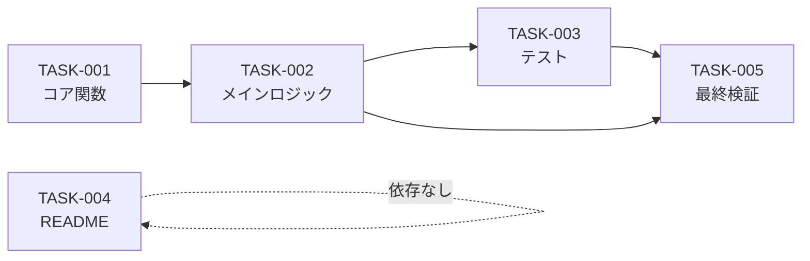

# タスク計画

## 概要

ccresmonの実装タスク計画。設計書（docs/sdd/design/）に基づき、5タスクを3フェーズに分割する。

### 進捗サマリ

| フェーズ | タスク数 | 完了 | 進捗率 |
|---------|---------|------|--------|
| Phase 1: コア実装 | 2 | 0 | 0% |
| Phase 2: テスト・ドキュメント | 2 | 0 | 0% |
| Phase 3: 品質チェック | 1 | 0 | 0% |
| **合計** | **5** | **0** | **0%** |

## タスク一覧

| ID | タイトル | フェーズ | 依存 | 工数 | ステータス | 詳細リンク |
|----|---------|---------|------|------|-----------|------------|
| TASK-001 | ccresmon.sh コア関数の実装 | Phase 1 | - | 30min | TODO | [詳細](phase-1/TASK-001.md) @phase-1/TASK-001.md |
| TASK-002 | ccresmon.sh メインロジック | Phase 1 | TASK-001 | 20min | TODO | [詳細](phase-1/TASK-002.md) @phase-1/TASK-002.md |
| TASK-003 | bats-core ユニットテスト | Phase 2 | TASK-002 | 40min | TODO | [詳細](phase-2/TASK-003.md) @phase-2/TASK-003.md |
| TASK-004 | README.md の作成 | Phase 2 | - | 15min | TODO | [詳細](phase-2/TASK-004.md) @phase-2/TASK-004.md |
| TASK-005 | shellcheck + 最終検証 | Phase 3 | TASK-002, TASK-003 | 20min | TODO | [詳細](phase-3/TASK-005.md) @phase-3/TASK-005.md |

**合計推定工数**: 125分

## 並列実行グループ

### グループA（最初に実行 - 順次）

| タスク | 対象ファイル | 依存 |
|--------|-------------|------|
| TASK-001 | ccresmon.sh | なし |
| TASK-002 | ccresmon.sh | TASK-001 |

> TASK-001 と TASK-002 は同一ファイル（ccresmon.sh）を対象とするため順次実行が必須。

### グループB（グループA完了後に並列実行可能）

| タスク | 対象ファイル | 依存 |
|--------|-------------|------|
| TASK-003 | tests/ccresmon.bats | TASK-002 |
| TASK-004 | README.md | なし |

> TASK-003 と TASK-004 は異なるファイルを対象とし並列実行可能。TASK-004 は依存関係がないため、実際にはグループA と並列実行も可能。

### グループC（グループB完了後に実行）

| タスク | 対象ファイル | 依存 |
|--------|-------------|------|
| TASK-005 | ccresmon.sh（修正のみ） | TASK-002, TASK-003 |

## 依存関係図



## 対象ファイル一覧

| ファイルパス | 作成タスク | 修正タスク |
|-------------|----------|----------|
| `ccresmon.sh` | TASK-001 | TASK-002, TASK-005 |
| `tests/ccresmon.bats` | TASK-003 | - |
| `README.md` | TASK-004 | - |

## 逆順レビュー（タスク → 設計 → 要件）

### タスク → 設計の整合性

| 設計コンポーネント | 対応タスク | 整合性 |
|-------------------|----------|--------|
| hook-dispatcher | TASK-002 | OK |
| resource-collector | TASK-001 | OK |
| threshold-config | TASK-001 | OK |
| message-formatter | TASK-001 | OK |
| DEC-001（単一スクリプト） | TASK-001, TASK-002 | OK |
| DEC-002（I/Oキャッシュ） | TASK-001 | OK |
| DEC-003（フェイルオープン） | TASK-001, TASK-002 | OK |

### 設計 → 要件の整合性

設計書の要件トレーサビリティ（design/index.md）にて全19件の機能要件 + 全9件の非機能要件の対応を確認済み。

---

## ドキュメント構成

```
docs/sdd/tasks/
├── index.md                 # このファイル（目次）
├── phase-1/
│   ├── TASK-001.md          # ccresmon.sh コア関数の実装
│   └── TASK-002.md          # ccresmon.sh メインロジック
├── phase-2/
│   ├── TASK-003.md          # bats-core ユニットテスト
│   └── TASK-004.md          # README.md の作成
└── phase-3/
    └── TASK-005.md          # shellcheck + 最終検証
```
